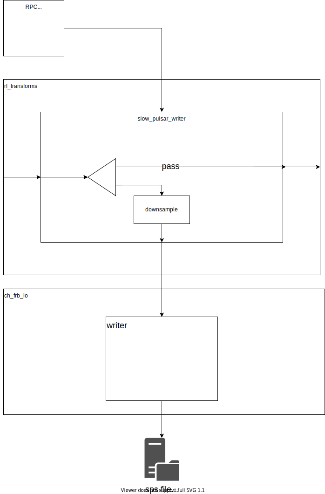
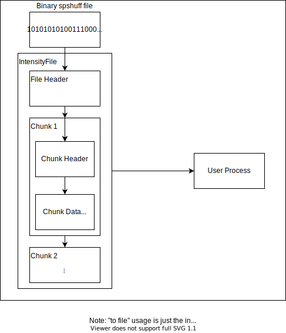

# L1 Intensity Data Processor

Leader : Alex 
Second : Kendrick

## Overview

The SPS intensity data processor serves to convert the intensity data dump from
the CHIME/FRB L1 system from 1 sec long msgpack format into a format that packs
the downsampled intensity data, the relevant RFI mask from the SPS RFI excision
process and a header containing the details of the data pack. The data pack will
then be stored in the intensity data storage of the SPS cluster for future use.
This part of the pipeline will be running in real time.

### Block Diagram


### Downsampling in channels

The SPS process does not require full 16k channels for dedispersion as the
maximum DM to search for in most parts of the sky is much lower than the search
range of the FRB system. Hence the intensity data will be downsampled to the
appropriate number of channels, starting from 1024 channels and increase by a
factor of 2. The downsampling depends on the sky positions within 0.5 degrees of
the RA, dec of the intensity data with the largest channel number requirement.
The downsampling will be done on 4s chunks of data.

### Downsampling in bit depth

To reduce the storage requirement in the SPS cluster, the data is downsampled in
bit depth from 8-bit to 3-bit using Huffman coding, which will minimise the
information loss due to downsampling.




## Specification

### Input:

- CHIME/FRB L1 data input stream: 8-bit intensity data with 16384 channels
- Control API
  - Requirement : A list of sky positions for beamforming and the LoS max DM / channel number required.

#### Control RPC API
TODO: explain parameters and whether it's an HTTP POST with JSON payload or ZMQ message
```
{
  beams: [],
  nfreqs: [],
  ntimes: [],
  nbins: [],
  write_flag: [],
}
```

### Output:
Output data is downsampled in frequency and bit depth: 3-bit intensity data with reduced number of channels.

#### Output Data Format
Binary file with initial file header and subsequent chunks.

- Output file format will always be of static size ~16MB
- Each output file will have variable number of 1s chunks depending on downsampling rate
- The output file will be saved in the following format:
    - `YYYY/MM/DD/beam_number/STARTCTIME_STOPCTIME.msgpack`
- The exact number of chunks present and their location in the file are not known until the file is read sequentially from beginning to the end
- The chunks will consist of metadata, as well as numpy arrays containing the chunk data. The numpy array shapes will be entirely determined by, and consistent with, the metadata, but will not be known a priori.
- **TODO**: add details of encoding (encoded with `astrohuff`?)

File Header:
- `beam_number`: CHIME/FRB beam number (`uint16`)
- `nbins`: quantization bins (`uint16`)
- `start`: timestamp (`uint64`)
- `end`: timestamp (`uint64`)

Chunk Header:
- `nfreq`: frequency channels (`uint16`)
- `ntime`: # of samples (`uint16`)
- `mean[nfreq]`: huffman encoded channel mean (`char`)
- `var[nFreq]`: huffman encoded channel variance (`char`)
- `bad_mask[nfreq][ntime]`: bad channel mask (`char`)
- `data[nfreq][ntime]`: huffman encoded data (`char`)

### Database:
- for each (beam, start time, end time):
  - Filename recording the samples
  - optional?
    - \# frequency channels
    - \# quantization bins
    - \# samples


### Metrics:

