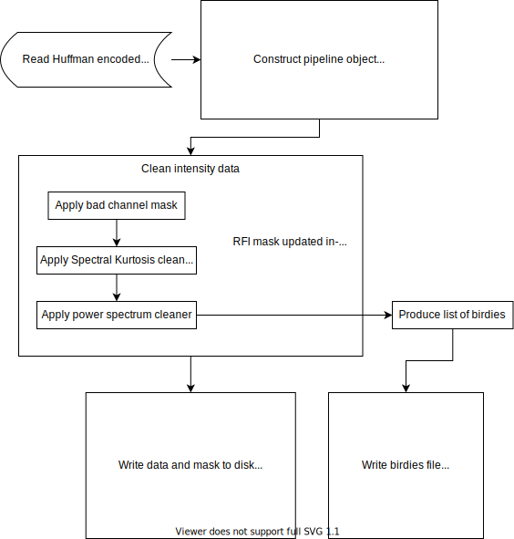

# RFI excision tool

Leader : Bradley

Second : Kathryn, Chitrang

## Overview

The SPS RFI excision pipeline uses a number of methods to remove RFI. Typically, the best performance is realised when
incorporating the CHIME/FRB L1 RFI mask and weights. The RFI excision requires data chunks of at least 4 seconds
(ideally 16 seconds, which enables easy power spectrum detection of periodic signals) and will need to promote the
nominal 3-bit intensity data sent from L1 to 32-bit floats for calculations. The RFI mask computed will be merged with
the mask from CHIME/FRB L1 and (optionally) downsampled in time such that each bit corresponds to the minimum RFI search
time (**NB**: not yet implemented). 

### Block Diagram


### Current processing steps
- Create a `RFIPipeline` object by passing three things:
  - a list (even if a single file) of file paths to load
  - the FRB beam number
  - a dictionary noting which cleaners to run
- Read data from given file list into a contiguous `numpy.ma.MaskedArray` of shape `[Nfreq][Ntime]`
  - if data are read from `.msg` or `.msgpack` files, the CHIME/FRB L1 weights and RFI masks are automatically applied
  - if data are read from a `.hdf5` file, it is assumed the format is as described below in the "Output" section
- _[Optional] Quantize the data according to the scheme designed for the L1 pre-processor_ (**NB**: not working as
expected)
- Depending on what configuration was specified on the commandline, run any number of cleaning procedures and update the
data mask inplace
  - i.e., each successive cleaning method works on the masked output of the previous
  - current order that methods apply: 
    1. known bad channel mask (no compute required)
    2. temporal kurtosis (channel independent, local to 128 time samples, flags channels with >75% of time samples
    masked)
    3. median absolute deviation (operates on local time chunks, graduating local frequency chunks, and mean spectrum,
    flag any channel with standard deviation of 0)
    4. spectral kurtosis (channel-independent, operates on time scales of 128, 1024, 4096 time steps)
    5. power spectrum (operates on frequency-averaged time series data, does not mask intensity data)
- Write output to either: HDF5 file (preferred), or filterbank file (requires additional processing to replace masked
data)
  - _[Optional] write intensity mask as a_ `.npy` _file_

## Interfaces

### Input:
For a single beam:
- Data pack containing the L1 3-bit intensity data
  - Also contains missing samples / RFI mask
- Known bad channel mask **(Requires re-evaluation)**
- **(Not implemented)** Known periodic signals (a.k.a. "birdies")

### Output:
- Raw intensity data `[Nfreq][Ntime]`
- Bad sample mask `[Nfreq][Ntime]`: 1 - masked; 0 - unmasked 
- Periodic signal mask : a list of periodic signals to blacklist (**NB**: this needs to work in order to make it useful
for H-hat quality control...)
- Metadata:
  - Beam number
  - Start, end timestamps
  - `Nfreq`: # frequency channels
  - `Ntime`: # samples
  
For the prototyping phase, files will be written between each successive step. The RFI processing pipeline will output
two files:
- 1 HDF5 file containing two datasets and metadata, named `startunixtime_enduntixtime.hdf5` (times truncated to
integers)
  - `intensity` (raw unmasked data)
  - `mask` (an integer mask of the same shape as the intensity dataset, 1 = masked)
  - metadata stored as HDF5 file attributes:
    - `beam_number` (FRB beam number, int)
    - `start` (start unix time of first sample, float)
    - `end` (end unix time of last sample, float)
    - `nchan` (number of frequency channels, int)
    - `ntime` (number of time samples, int)
- 1 ASCII text file containing temporal frequencies and power spectrum amplitudes of periodic signals, named
`startunixtime_endunixtime.birds` (times truncated to integers)
  - line 1: header, prefixed with `#`, describes columns (first = frequency in Hz, second = power)
  - line 2+: (frequency, power) pairs, separated by a single space character

### Database:

### Metrics:
- Information about the amount of data masked for each pack of intensity data.
- Number of periodic signals found/flagged


### Usage example
To run this code, you will need to have access to `iautils` 
(I use a docker image on `frb-anlaysis5`). An example bash script to run the 
RFI cleaning code is given below.

```python
from rfi_mitigation.pipeline import RFIPipeline

masking_dict = dict(
weights=True,  # apply msgpack weights
l1=True,  # apply L1 RFI mask
badchan=True,  # apply known bad channel mask
kurtosis=True,  # run temporal kurtosis filter
mad=True,  # run median absolute deviation outlier filter
sk=True,  # run spectral kurtosis filter
dummy=False  # run a dummy filter that does nothing
)

msgpack_list = [...]  # nominally a list of 16 paths to msgpack data files
frb_beam_number = 0  # the FRB beam number, could be retrieved from msgpack path information

# if the msgpack files are archived data (suffix = .msg) rather than callback data (suffix = .msgpack) 
is_callback = False

rfiPipe = RFIPipeline(msgpack_list, frb_beam_number, masking_dict)
rfiPipe.read_chunk(is_callback=is_callback)
rfiPipe.clean()
rfiPipe.write_to_hdf5()
```
