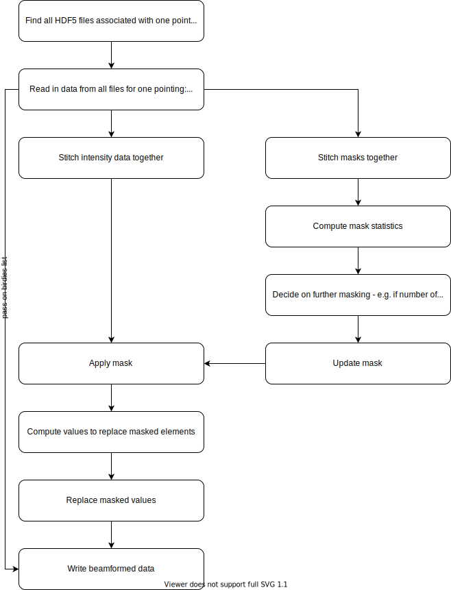

# Beamformer

Leader : Chia Min
Second : Shiny, Chitrang

## Overview

Here the intensity data of individual FRB beams are combined to form a sky-beam tracking a sky position.
The current idea is to go through the intensity data in time blocks equal to the length of a 4096 
channels intensity data (expected to be around 10s).
The steps are as of follow : 

- The timestamp to work on a set of intensity data is identified. This will need a rolling counter to 
keep track. The counter should also update if FRB/L1 acquisation is restarted to not look for a bunch 
of missing data
- Load all the intensity data that corresponds to this timestamp :
  - 4 packs of data for 16384 channels data.
  - 2 packs of data for 8192 channels data.
  - 1 pack of data for 4096 channels data.
  - Check if the corresponding pack of data is loaded for 1024 and 2048 channels data, if not load them.
  - If any intensity data pack is missing, create a zero mean, unit standard deviation noise data.
- Upsample intensity data from 3 bits to 8 bits (or downsample from 32 bits if received directly 
from RFI excision).
- Mask and normalise intensity data.
- Determine the pointings to form by determining the (RA, Dec) that are currently have x-y positions 
of -0.6 < x < 1.0 and y < 41.68.
- Initialise an array if a pointing is new, this can be done by checking if x-y positions is outside 
the range during the previous timestamp.
- Check if the other pointings have array set up and filled in with the correct data previously. 
  - Use a counter to record current length and the first timestamp of the pointing.
  - If not identify as failed and notify database (unless database says it is completed).
- Check if a pointing has the expected length now. If so identify the pointing as complete, notify 
database and send the array to dedispersion process.
  - The length of each pointing must be constant for hhat computation to produce consistently sized 
arrays between days.
  - This length should be recorded in the sky pointing/LoS max DM list. 
  - This length is calculated through iterating through timestamp blocks to find the length in time 
each pointings stay within the x-y position limits.
- Calculate the relative sensitivity of all nearby FRB beams for a given pointing and timestamp. 
Record the sensitivities relative to the most sensitive beam.
- Here, two methods is proposed to actually form the tracking sky-beam:
  - Find the beam that has the maximum sensitivity and append to the array of the pointing.
  - Weighted addition of all nearby FRB beams with relative sensitivity above 0.5. As the FRB beam 
sensitivity are highly frequency dependent, this needs to be done on sets of frequency channels, 
most likely in 256 frequency blocks across the bandwidth.
- Compute the telescope sensitivity of the FRB beams added to the array to later compute the average 
telescope sensitivity across time at the pointing.
- (Optionally) Check if any appended array has the expected length. If so mark as complete and 
release the array to dedispersion.

Special Cases - pointings with very long transit time :
- If the expected length of a pointing is more than a multiple of 500s, split the data by that factor
  - e.g 1600s data split into 3 sets of 520s chunks.
- For these pointings, a separate counter is require to note the chunk length and expected number of 
chunks so that it will initialise a new array for each chunk instead of marking the pointing as failed.
- Each chunk will have the same (RA, Dec) as they are going to be co-added to the daily hhat stack.

### Block Diagram

## Interfaces

### Input:
- Cleaned L1 data chunks
  - In blocks with length in time equivalent to the length of single 4096 channels chunk
- Beam control:
  - For single beam
    - Sky coordinate
    - Current status of beam (active or not)
    - Current length of beam
    - Start, end timestamps
  - For the whole process
    - Number of active beams
  - For intensity data
    - Current timestamp of the intensity data loaded
    - Status of the intensity data (available or missing)

### Output:
- sky-beams of length T with N channels depending on sky position, indexed by their RA, Dec
  - Sky coordinate (RA, Dec)
  - Start, end timestamps
  - Total length
  - Chunk number (for pointings split to multiple chunks)
  - Nfreq
  - Ntime
  - Spectra[Nfrq][Ntime]

### Requirements:
1. FRB beam model, 
2. List of sky position with LoS max DM/channel numbers required and the
   expected length of spectra in multiples of the length of 4096 channel chunks,
3. Database tracking the current timestamp to load intensity data and beamform,
4. Database containing missing intensity data,
5. Database of the calibration and RFI fraction of the intensity data.

### Database:
- for each (Sky coordinate, start time, end time)
  - Filename recording the samples

### Metrics:
- Information about the status of the pointing for the day:
  - completed
  - failed
  - partially completed (for cases where data is split into multiple chunks)
- Expected sensitivity of the sky-beam formed for a particular day based on
  calibration from CHIME/FRB and the RFI fraction of the intensity data.

