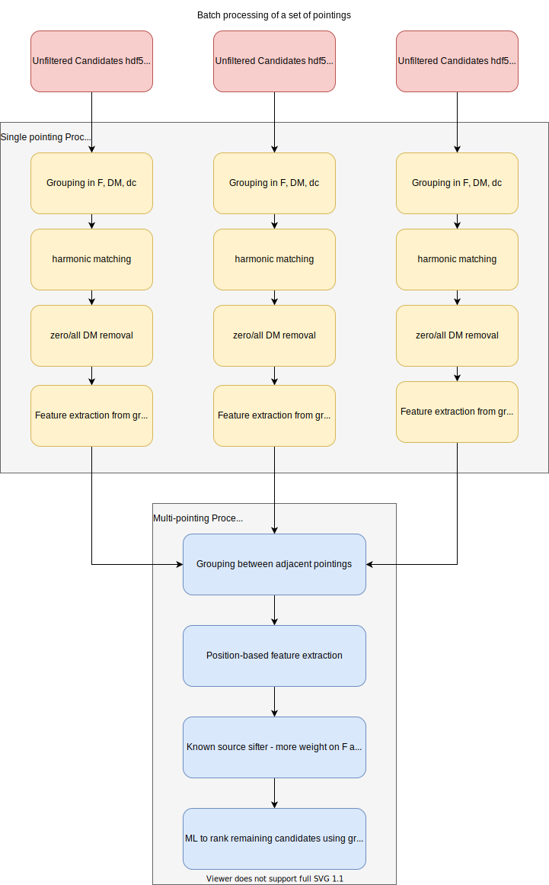

# Candidates processor

Leader : -
Second : Shiny, Chitrang, Kathryn

## Overview

The candidates processor deals with triggers that come out of the hhat search,
either from single day stacks or from cumulative stacks. It will then group the
candidates by frequency/DM/dc within a sky-beam, and then between adjacent
sky-beam and sky-beams along the side lobe arc. The candidates will then be
filtered through the known source sifter before going through the last round of
selection using Machine Learning to pick the best candidates. This is expected
to be run on a separate node from the quasi-real time processes of the SPS
cluster.

### Block Diagram

## Interfaces

### Input:
- Triggers from single day hhat stack and cumulative hhat stack, as (DM, f, dc) tuple and the hhat value.
- Hhat process control:
  - Sky coordinate
  - Start, end timestamps

### Output:
- Single day candidates for beamforming and folding
  - Sky coordinate
  - Frequency
  - Duty cycle
  - DM
  - slice through Hhat stack at candidate frequency (DM-dc plane)
  - Source Hhat stack
  - Candidate grouping (neighbouring frequencies, harmonics, side-lobe arc, nearby sky positions)
  - Known source classification
  - Future: Additional ML classification?
- First detection of known pulsars for beamforming and folding
- Cumulative stack candidates for beamforming and transport to Compute Canada.

### Control System Requirements:
- FRB known source database
- Side lobe arc of FRB system

### Metrics:
- Zero DM periodic sources detected for hhat quality control.
- List of candidates from single day and cumulative stack searches

